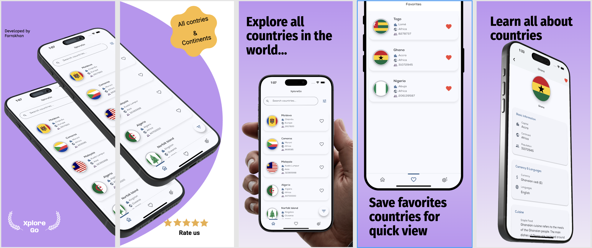

# XploreGo

A Flutter app for exploring countries around the world with detailed information, favorites, and search functionality. 



## Features

- **Country Exploration**: Browse 195+ countries with detailed information
- **Smart Search**: Find countries quickly with real-time search
- **Favorites**: Save your favorite countries for easy access
- **Rich Data**: View capital cities, populations, currencies, languages, and more
- **Beautiful UI**: Modern Material Design 3 with dark/light theme support
- **Fast Performance**: Local caching for instant startup and smooth navigation
- **Advanced Filtering**: Filter by continent, language, and currency
- **Responsive Design**: Optimized for all device sizes

## Getting Started

### Prerequisites
- Flutter SDK (latest stable version)
- Dart SDK

### Installation

1. Clone the repository
```bash
git clone https://github.com/farrakhanwahab/XploreGo_app.git
cd XploreGo_app
```

2. Install dependencies
```bash
flutter pub get
```

3. Run the app
```bash
flutter run
```

## Tech Stack

- **Framework**: Flutter
- **State Management**: Provider
- **HTTP Client**: Dio
- **Image Caching**: Cached Network Image
- **Local Storage**: Shared Preferences
- **Animations**: Lottie
- **UI Components**: Material Design 3

## APIs

XploreGo uses two APIs to provide comprehensive country information:

- **[REST Countries API](https://restcountries.com/)**: Fetches country data including flags, capitals, populations, currencies, and languages
- **[Wikipedia API](https://en.wikipedia.org/api/)**: Retrieves staple food information for each country to provide cultural context
